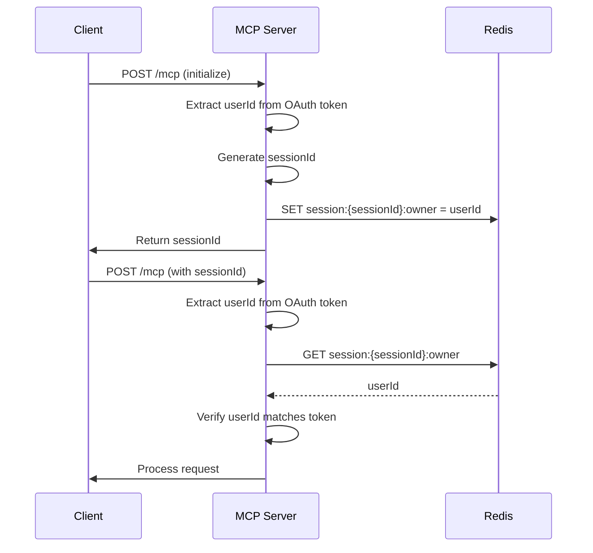

# Session Ownership System

## Overview

The MCP server implements multi-user session isolation to ensure users can only access their own MCP sessions. This is accomplished using user identifiers and session ownership tracking.

**Note**: While this document describes Redis-backed storage, the server also supports in-memory storage for development. When Redis is not configured, session data is stored in memory and lost on restart.

## Why Sessions?

Sessions serve two purposes in the current implementation:

1. **MCP Server State**: The MCP protocol maintains stateful connections (resource subscriptions, notification intervals, etc.). The MCP SDK's `StreamableHTTPServerTransport` is designed around sessions to maintain this state across requests.

2. **Ownership Tracking**: Currently, the system tracks which user owns each session to prevent cross-user access. However, **this is somewhat redundant** since:
   - Every request includes a validated OAuth JWT token
   - The JWT contains the user ID (`sub` claim)
   - We could validate ownership on each request using just the JWT

**Potential Simplification**: If we validate the JWT on every request (which we already do), we could:
- Remove session ownership tracking entirely
- Use the JWT's `sub` claim directly for authorization
- Still maintain sessions for MCP server state, but without ownership tracking

The current implementation uses sessions for both purposes, but the ownership tracking adds complexity (Redis/in-memory storage, session liveness checks, etc.) that may not be necessary if JWT validation is sufficient.

## How It Works

Each MCP session is owned by a specific user. Session ownership is stored in Redis (or in-memory when Redis is not configured) and validated on each request.

### User ID Assignment

**Production**: OAuth providers assign unique user identifiers via the `sub` (subject) claim - a standard OAuth/OpenID Connect field.

User ID sources:
- **Provider's user database**: Users created in Auth0/Okta (example: `auth0|507f1f77bcf86cd799439011`)
- **Social/federated identities**: Provider links to Google, Facebook (example: `google-oauth2|112233445566778899`)
- **Enterprise connections**: SAML, LDAP, Active Directory (example: `samlp|ad|john.doe@company.com`)

**Demo mode**: The demo auth server simulates user authentication by generating unique user IDs. This allows testing multi-user scenarios without a real identity provider.

### Token Validation

When the MCP server validates an access token:

1. MCP server calls the auth server's `/introspect` endpoint with the token
2. Auth server validates the token and returns user information including the `sub` field (user ID)
3. MCP server populates `AuthInfo.extra.userId` with this user identifier

This separation allows the auth server to be replaced with any OAuth provider that supports token introspection.

### Session Creation

```typescript
const userId = req.auth?.extra?.userId;
const sessionId = randomUUID();
await redisClient.set(`session:${sessionId}:owner`, userId);
```

### Session Access Validation

```typescript
const owner = await redisClient.get(`session:${sessionId}:owner`);
if (owner !== userId) {
  throw new Error('Session not owned by user');
}
```

## Redis Key Structure

### Session Ownership
```
session:{sessionId}:owner → userId
```

Example: `session:550e8400-...:owner` → `auth0|507f1f77bcf86cd799439011`

### Session Liveness

Sessions are considered "live" when an MCP server process is actively handling them. This is tracked via pub/sub subscription counts (Redis or in-memory):

```
mcp:shttp:toserver:{sessionId} → pub/sub channel
```

**With Redis**: Check if live: `PUBSUB NUMSUB mcp:shttp:toserver:{sessionId}` returns > 0

**Without Redis (in-memory mode)**: The `MockRedisClient` tracks active subscriptions in memory. When a session shuts down, the subscription is removed from the in-memory subscribers map.

When an MCP server starts handling a session, it subscribes to the channel. When it shuts down (gracefully, via timeout, or crash), the subscription is automatically removed.

**"Session not live" messages**: These debug logs appear when:
1. A session has timed out due to inactivity (default: 5 minutes)
2. A session was explicitly shut down
3. The server process handling the session crashed or restarted
4. A client attempts to use a sessionId that no longer has an active transport

This is expected behavior - the session is no longer active, so ownership checks correctly fail.

## Security

- **Session isolation**: Users can only access sessions they own
- **Ownership persistence**: 
  - With Redis: Survives across requests and server restarts
  - Without Redis: Persists only during server uptime (lost on restart)
- **Token-based validation**: User ID extracted from validated OAuth token
- **Access control**: All operations (GET, POST, DELETE) validate ownership
- **Session liveness check**: Sessions must be both owned by the user AND actively live (have an active transport)

## Implementation

### Core Functions (src/modules/mcp/services/redisTransport.ts)

```typescript
export async function setSessionOwner(sessionId: string, userId: string): Promise<void>
export async function isSessionOwnedBy(sessionId: string, userId: string): Promise<boolean>
export async function isLive(sessionId: string): Promise<boolean>
export async function shutdownSession(sessionId: string): Promise<void>
```

**`isSessionOwnedBy` flow**:
1. First checks if session is live via `isLive()` (checks for active subscriptions)
2. If not live, logs "Session not live" (DEBUG level) and returns `false`
3. If live, validates ownership by comparing stored owner with provided userId
4. Returns `true` only if both conditions are met (live AND owned by user)

**`isLive` implementation**:
- With Redis: Uses `PUBSUB NUMSUB` to count active subscriptions
- Without Redis: Uses `MockRedisClient.numsub()` which checks in-memory subscribers map

### Request Flow




## Storage Modes

### Redis Mode (Production)
When `REDIS_URL` is set, the system uses a real Redis connection for:
- Session ownership persistence across server restarts
- Pub/sub for message routing between clients and MCP servers
- Multi-server deployments (multiple MCP server instances can share sessions)

### In-Memory Mode (Development)
When `REDIS_URL` is **not** set, the system uses `MockRedisClient`:
- Session ownership stored in memory (lost on restart)
- Pub/sub simulated using in-memory Maps
- Single-server deployments only
- Useful for local development and testing

The system automatically selects the appropriate client:
```typescript
redisClient = process.env.REDIS_URL
  ? new RedisClientImpl()    // Real Redis
  : new MockRedisClient();   // In-memory mock
```

## Configuration

### Environment Variables
```bash
# Optional - if not set, uses in-memory storage
REDIS_URL=redis://localhost:6379
BASE_URI=http://localhost:3232
```

### Redis Monitoring

```bash
# List all session owners
redis-cli KEYS "session:*:owner"

# Check specific session ownership
redis-cli GET "session:{sessionId}:owner"

# Check if session is live (actively being handled)
redis-cli PUBSUB NUMSUB "mcp:shttp:toserver:{sessionId}"

# Monitor session operations
redis-cli MONITOR | grep "session:"
```

## Troubleshooting

### "Session not live" Messages

The debug log message `"Session not live"` is emitted from:
- **Location**: `src/modules/mcp/services/redisTransport.ts:98` in the `isSessionOwnedBy()` function
- **When it appears**: When a client attempts to use a sessionId that no longer has an active transport/subscription
- **Common scenarios**:
  1. Session timed out after 5 minutes of inactivity
  2. Session was explicitly shut down
  3. Server process handling the session crashed or restarted
  4. Client is using a stale sessionId

**What happens next**:
- `isSessionOwnedBy()` returns `false`
- The request handler logs `"Session ownership mismatch"` (WARNING level)
- Client receives HTTP 401 with error code -32001: "Session not found or access denied"
- Client should initialize a new session

**This is expected behavior** - expired/inactive sessions should not be accessible.

## Testing

```bash
# Test session isolation
npm test -- --testNamePattern="User Session Isolation"

# Test session ownership
npm test -- --testNamePattern="Session Ownership"
```

## References

- [RFC 7662: Token Introspection](https://datatracker.ietf.org/doc/html/rfc7662) - Standard for `sub` claim
- [MCP Authorization Spec](https://modelcontextprotocol.io/specification/2025-06-18/basic/authorization)
